<!--
  ============================================================================
   GENERATED FILE - DO NOT EDIT
   Built by scripts/build.mjs from README.template.md.
   Edit the template. This file is overwritten by .github/workflows/build.yml.
  ============================================================================
-->
<div align="center">



### 🏆 &nbsp;2nd overall at HackGT 12 &nbsp;·&nbsp; 300+ teams &nbsp;·&nbsp; [RefNet](https://github.com/NikhileshThiru/RefNet)

[](https://nikhileshthiru.pages.dev/) [](https://github.com/Scribur-com) [](https://www.linkedin.com/in/nikhilesh-thiruvengadam) [](https://x.com/NikhileshThiru) [](mailto:nikhilesh.thiru@gmail.com) [](https://github.com/NikhileshThiru?tab=repositories)


</div>

### `> whoami`

```yaml
role:        Co-founder & CTO @ Scribur
focus:       [ AI systems, full-stack product, developer tooling ]
location:    Atlanta, GA
education:
  school:    Georgia Institute of Technology
  degree:    B.S. Computer Science
  threads:   [ Intelligence, Internetworks ]
  grad:      2028
highlight:   2nd overall out of 300+ teams at HackGT 12 — RefNet
shipping:    Scribur — an operating system for in-house UGC teams.
             React · Supabase · Kimi K2 · Apify. Delaware C Corp, platform live.
background:  25+ client sites shipped · Roblox game dev
daily:       neovim + tmux + ghostty + claude code
```

<div align="center"></div>

### `> ls ./projects --active`

<!-- PROJECTS:START -->
**[RefNet](https://github.com/NikhileshThiru/RefNet)**

> 🏆 2nd Place Winner at HackGT 12 | AI-powered research paper search & citation network visualization with intelligent literature review generation. Built with React, Flask, Express.js, OpenAI GPT-4o, and D3.js. Deployed on AWS EC2 with Docker.

`javascript`

**[octave](https://github.com/NikhileshThiru/octave)**

> Live music recognition with drift-corrected synced lyrics — React + FastAPI + ACRCloud + Whisper

`fastapi` `lyrics` `music-recognition` `react` `synced-lyrics` `web-audio-api` `whisper`

**[nikhileshthiru-site](https://github.com/NikhileshThiru/nikhileshthiru-site)** &nbsp;·&nbsp; [`↗ live`](https://nikhileshthiru.pages.dev/)

> My interactive personal portfolio built to feel like a Windows 95 desktop, with boot sequence, draggable app windows, an in-browser "Internet Explorer", and a VS Code-style file explorer/editor.

`javascript`

**[lifetracker](https://github.com/NikhileshThiru/lifetracker)** &nbsp;·&nbsp; `★ 2`

> Voice-first personal timeline for iPhone — press the Action Button, say what you're doing, and on-device AI structures your day into an editable timeline. 100% on-device (SpeechAnalyzer + Apple FoundationModels).

`apple-intelligence` `ios` `on-device-ai` `swift` `swiftui`

**[TweetAgent](https://github.com/NikhileshThiru/TweetAgent)** &nbsp;·&nbsp; [`↗ live`](https://tweet-agent-ten.vercel.app)

> AI tweet drafts grounded in live news. React + TS · Python serverless · Supabase · Gemini. A review UI that learns your voice.

`gemini` `llm` `postgres` `python` `react` `supabase` `typescript` `vercel`

**[runaround](https://github.com/NikhileshThiru/runaround)** &nbsp;·&nbsp; [`↗ live`](https://run-around.vercel.app/)

> Adaptive running intelligence platform featuring Strava-powered analytics, AI coaching, and a 3D global journey visualization.

`gemini-api` `react` `strava-api` `tailwindcss` `threejs` `typescript` `vercel` `vite`
<!-- PROJECTS:END -->

<div align="center"></div>

### `> cat ./stack.json`

<div align="center">


<br/>

<br/>


</div>

<div align="center"></div>

### `> btop --user nikhilesh`

<div align="center">


<br/>
<br/>


</div>

<div align="center"></div>

### `> tail -f ./now.log`

<!-- NOWLOG:START -->
```
[WORK]  2026-09-09  lifetracker ..........  swift · Voice-first personal timeline…
[WORK]  2026-07-08  nikhileshthiru-site ..  javascript · My interactive personal…
[WORK]  2026-07-03  octave ...............  javascript · Live music recognition with…
[WORK]  2026-07-02  TweetAgent ...........  python · AI tweet drafts grounded in…
[WORK]  2026-06-24  runaround ............  typescript · Adaptive running…
[WORK]  2026-03-01  RefNet ...............  javascript · 🏆 2nd Place Winner at…
[SYNC]  last updated 2026-09-09T16:03:55Z UTC
```
<!-- NOWLOG:END -->

<div align="center">


<sub>this page rebuilds itself every 6 hours · <a href="https://github.com/NikhileshThiru/NikhileshThiru/blob/main/.github/workflows/build.yml">build.yml</a> · <a href="https://github.com/NikhileshThiru/NikhileshThiru/blob/main/README.template.md">README.template.md</a></sub>

</div>
